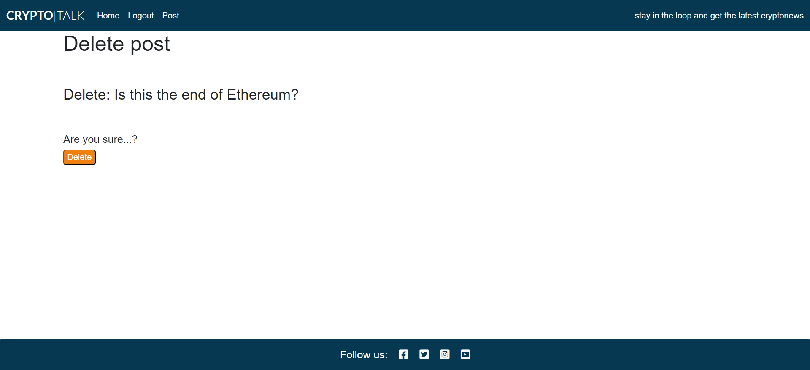

# CryptoTalk

# The purpose with this project

Few subjects today can get people going like crypto. It´s something that almost everyone has an opinion about. Its a topic that many don´t really fully understand. It´s also a subject that people like or dislike for many different reasons. CryptoTalk is a blog for anyone interested in crypto. It´s a way for someone with a opinion on crypto to share that with others. 

Required technologies for this project:

- HTML, CSS, JavaScript, Python+Django
- Relational database (SQL)

A live version of this project can be found at this url: <https://cryptalk-32183a196317.herokuapp.com/>

# Table of Content

- [CryptoTalk](#cryptotalk)
- [The purpose with this project](#the-purpose-with-this-project)
- [Table of Content](#table-of-content)
  - [UX](#ux)
    - [User Demographic](#user-demographic)
    - [User Goals](#user-goals)
    - [User Stories](#user-stories)
      - [Admin](#admin)
      - [User](#user)
    - [Project Purpose](#project-purpose)
    - [Design diagram](#design-diagram)
    - [Database scheme](#design-diagram)
    - [Site navigation](#site-navigation)
  - [Features](#features)
    - [Existing Features](#existing-features)
      - [Home](#home)
      - [Navbar](#navbar)
      - [Sign Up](#sign-up)
      - [Login](#login)
      - [Logout](#logout)
      - [Add Post](#add-post)
      - [PostDetailView](#postdetailview)
      - [Edit](#edit)
      - [Delete](#delete)
      - [Comment](#comment)
      - [Footer](#footer)
  - [Features left to implement](#features-left-to-implement)
  - [Languages used](#languages-used)
    - [Frameworks, libraries and tools](#frameworks-libraries-and-tools)
    - [Installed packages](#installed-packages)
  - [Testing](#testing)
  - [Bugs](#bugs)
    - [Directory issue with allauth.](#directory-issue-with-allauth)
    - [Blocktrans](#blocktrans)
    - [Placeholder image](#placeholder-image)
    - [Field required](#field-required)
    - [Deployment](#deployment)
  - [Unfixed bugs](#unfixed-bugs)
    - [Automated testing](#automated-testing)
    - [Validator Testing](#validator-testing)
  - [Deployment](#deployment-1)
  - [Credits](#credits)
    - [Home](#home-1)
    - [Navbar](#navbar-1)
    - [Footer](#footer-1)
    - [Sign Up](#sign-up-1)
    - [Login](#login-1)
    - [Logout](#logout-1)
    - [Add post](#add-post-1)
    - [PostDetailView](#postdetailview-1)
    - [Edit](#edit-1)
    - [Delete](#delete-1)
    - [Comment](#comment-1)

+ [Languages used](#languages-used "Languages used")
  - [Frameworks and libraries and tools](#frameworks-and-libraries-and-tools "Frameworks and libraries and tools")
  - [Installed packages](#installed-packages "Installed packages")
- [Testing](#testing "Testing")
  - [Bugs during development](#bugs-during-development "Bugs during development")
  - [Validator Testing](#validator-testing "Validator Testing")
  - [Unfixed Bugs](#unfixed-bugs "Unfixed Bugs")
- [Deployment](#deployment "deployment")
- [Content](#content "Content")
- [Credits](#credits "Credits")

## UX

### User Demographic

This application is ment for:

- Everyone with a interest in cryptonews
  
### User Goals

To create a user friendly website that is appealing. To create a website for cryptoentusiasts to share the latest news and with that stay ahead of the curve.  

### User Stories

The following user stories has been implemented in the project. User Stories are based on two types of users, the admin and the user. More user stories will be implemented in future versions.

#### Admin

As a **site admin** I can **create, read, update and delete posts** so that **I can manage my blog content**

As a **site user/admin** I can **view the number of likes on each post** so that **I can see wich is the most polular or viral**

As a **admin** I can **create draft posts** so that **I can finish writing the content later.**

As a **admin** I can **approve or disapprove comments** so that **I can filter out objectionable comments**

As a **site user/admin** I can **view comments on a individual post** so that **I can read the conversation**

#### User

As a **site user** I can **view a paginated list of posts** so that **I can easily select a post to view**

As a **site user** I can **register an account** so that **I can comment and like**

As a **site user** I can **click on a post** so that **I can read the full text**

As a **site user** I can **leave comments on a post** so that **I can be involved in the conversation**

As a **site user** I can **like or unlike a post** so that **I can interact with the content**

As a **site user** I can **view a list of posts** so that **I can select one to read**

As a **site user** I can **create posts** so that **I can participate in the conversation**

As a **site user** I can **edit my posts** so that **having the flexibility to change the content**

As a **site user** I can **delete posts** so that **being able to delete unwanted posts**

As a **site user** I can **delete/edit posts** so that **only I can delete/edit my own posts**

### Project Purpose

From Code Institutes assessment guide:

In this project, you'll build a Full-Stack site based on business logic used to control a centrally-owned dataset. You will set up an authentication mechanism and provide role-based access to the site's data or other activities based on the dataset.

### Design diagram

The idea of behind CryptoTalk´s design is simplicity. My main focus here was to implement CRUD and to get the django elemnts working. 

### Database scheme

### Site navigation

## Features

Cryptotalk consists of features avaliable for the site user and admin. 

### Existing Features

#### Home

The homepage contains the latest post and is the common redirect in this project. 

#### Navbar

The sites navbar is located at the top of each page. This adds to consistency and helps the user to navigate around. 

#### Sign Up

The sites sign up page is simple and intuitive. 

#### Login
The sites login page tells the user what it needs to validate. 

#### Logout
The sites logout page asks one simple question. 

#### Add Post
The sites add post feature also asks for content and body. It also gives the user the option to add a image. 

#### PostDetailView

The postdetailview is the body of the post and contains the img, author, title, postdate, likes and depending on autherisation delete/edit links.

#### Edit 
The sites edit page gives the user the option to reenter the info. The edit page only appears if the user is authenticated and the author of the post. 

#### Delete
The sites delete page gives the user the option to delete the post. The delete page only appears if the user is authenticated and the author of the post. 

#### Comment
The comment section easily gives users to comment on each others post. They can also like the post. 

#### Footer
The sites footer is located in the bottom of the page. It contains socialmedia-links. 

## Features left to implement

- Password reset function using email
- Alert message that tells the user that the post is awaiting approval. 

## Languages used

- HTML5
- CSS3
- Javascript
- Python
- Django
- SQL 

### Frameworks, libraries and tools

- Codeanywhere
- GitHub
- Django
- Bootstrap
- Cloudinary

### Installed packages

- asgiref==3.7.2
- cloudinary==1.36.0
- dj-database-url==0.5.0
- dj3-cloudinary-storage==0.0.6
- Django==3.2.23
- django-allauth==0.58.2
- django-crispy-forms==1.14.0
- django-summernote==0.8.20.0
- gunicorn==21.2.0
- oauthlib==3.2.2
- psycopg2==2.9.9
- PyJWT==2.8.0
- python3-openid==3.2.0
- pytz==2023.3.post1
- requests-oauthlib==1.3.1
- sqlparse==0.4.4

## Testing 
All testing in this project has been done manually during the development process, the project has not followed the principles of test driven development. Testing has for the most part followed the track of the user stories. Everytime a user story is concluded testing has been done to make sure the new feature is working. This has been done by simply clicking on the buttons/links and testing all the functions to see if it produced the desired outcome. All the functions in the project are working. 

Django is a python framework so most of the code is written in python. The part of the code that is in js is the alert messages. They work as expected. CryptoTalk has today no socialmedia today so the links go to their respective homepages.

Because this project was developed with Bootstrap it is fully responsive on all screen sizes.  

In the development of this project I encountered several bugs. They are covered in the bugs section. 

## Bugs 
During development of this project I encountered several bugs. Some of them are covered here:

  ### Directory issue with allauth. 
  When running the command ls ../.pip-modules/lib/ it told me that there is no such directory. I understood that I have a issue with the directory. I googled it and found a command to find the path to where python is installed. To do this I used the command "which python3". It gave me the path "/home/codeany/.pyenv/shims/python3". However this did not work. To make sure I hade really installed allauth I searched for a command to check this. I found the command "pip show django-allauth". This gave me info regarding the version of allauth installed and more. In the info I found another path to the directory "/home/codeany/.local/lib/python3.9/site-packages". I tried this path instead and followed the instructions in the video and it worked.
'

### Blocktrans
In the login.html template there is an block of code   " 
Welcome to CryptoTalk. To leave a comment or like a post, please log in. If you
have not created an account yet, then <a class="link" href="{{ signup_url }}">sign up</a>first.
 "

When running this code in the IDE it told me that a  cannot have a url path inside it. I removed the  tags and the problem was fixed.

### Placeholder image

To change the placeholder image took a little longer then expected. My first thought was that I only needed to change the link in the index.html. However when i did this nothing happened. I tried severeal different images and it gave me the same result. I then understood that it was a Cloudinary issue. I logged in to my cloudinary and added the image to my library. After that it worked. 

### Field required

When as a admin I want to approve a comment, django required that the body field and the content field to be filled. This means that I had to copy the text in the content and adding it to the body field. To fix this I added the blank=True statement to the content field in Post class model. 

### Deployment

When deploying the project to heroku I encountered a problem. Heroku gave me the message "Bad Request 404". To get a more detailed errormessage I switched the DEBUG to  DEBUG = 'DEBUG' in os.environ. I also added DEBUG to confug vars in heroku. Heroku gave me the erromessage that I need to add a link <https://cryptalk-32183a196317.herokuapp.com> to ALLOWED_HOSTS. But it was already added from earlier. After contacting tutorsupport I was told to put the hosts in one list. I did so and heroku loaded the app. However now without the css. I deleted the DEBUG config vars and the app rendered as expected. 

## Unfixed bugs 

### Automated testing
I initiated the automated testing. I wanted to test with pythons unittest and to use jest for the little js code in the project. However I could not fix the import issue. When running the tests I got the message that its missing a parent directory and I couldn´t import the block of code I wanted tested. To resolve this I contacted the tutor support that Code Institute provides. That tutor couldn´t locate the problem. Considering the deadline and that its not required for this project, I decided to proceed with only manual testing. 

### Validator Testing

Testing with <https://validator.w3.org/> shows errors in html:

The errors shown are related to the templates from the "I think therefore I blog" walkthrough project. Some of the errors are regarding too long lines and come from the django templates. And some of the errors always appear when saved. Thats why I can´t produce a clean slate of no errors in the html. The errors don´t effect functionality.

Testing with lighthouse gives the following results:

Testing and validating using pep8 validations tools:
Testing with <https://www.pythonchecker.com/>
Testing the pythonchecker.com came back with good results. Testing the base.html file came back 100% no errors. Testing the other python files came back with minor errors such as "whitespaces around operators" and "add two empty lines in front of function". Nothing that effects functionality.  

Testing with <https://jigsaw.w3.org/css-validator/> show no errors in CSS:

## Deployment

The site was deployed to Heroku. The steps to deploy are as follows:

The project was developed using Codeanywhere with regular commits to Github. In order to deploy to Heroku a requirements.txt file needs to be created
and it is important that the database is created in Heroku so that the database can be migrated before actual deployment.

Before deploying to Heroku there where a couple of steps. 

- The debug was set to: False
- In the settings.py file on line was added: X_FRAME_OPTIONS : 'SAMEORIGIN'
- On herokus website in the config vars settings I removed the: DISABLE_COLLECTSTATIC  : 1
- Last I clicked the deploy-button.

All values was provided by Heroku and I used env.py to store the values for my project and used the variables for the values in settings.py for the Database url and secret key. Heroku also needs to be set as an allowed host in settings.py. 

After those steps were taken the application was deployed at the following link: <https://cryptalk-32183a196317.herokuapp.com/>

## Credits

- The colors choosen in this project come from <https://www.canva.com/learn/100-color-combinations/> - Day & Night

I have utilised many websites for the development of this project. Here are some of them. 

- [W3 Schools](https://www.w3schools.com) for helping me understand Django.
- [Code Institute](https://codeinstitute.net/) for all course material leading up to this project.
- [Stack Overflow](https://stackoverflow.com/) for hours of searching and troubleshooting.
- [Codemy](https://codemy.com/) - Django Blog
- [Python Tutor](https://pythontutor.com/)
- [Tech with Tim](https://www.youtube.com/watch?v=nGIg40xs9e4) - Learn Django in 20 minutes
- [Freecode camp](https://www.youtube.com/watch?v=F5mRW0jo-U4) - Python Django Web Framework - Full Course for Beginners.

Here is a list of the features in the projected and the code that inspired them. 

### Home
The template for the homepage was taken from the "I think therefore I Blog" walkthrough project. I kept the navbar and footer. I styled them with my own colors. 

### Navbar
The template for the navbar was taken from the "I think therefore I Blog" walkthrough project.
The styling of the navbar is all me. 

### Footer
The template for the footer was taken from the "I think therefore I Blog" walkthrough project.
The styling of the footer is all me.

### Sign Up
The template for the signup page was taken from the "I think therefore I Blog" walkthrough project. 

### Login
The template for the login page was taken from the "I think therefore I Blog" walkthrough project.

### Logout
The template for the logout page was taken from the "I think therefore I Blog" walkthrough project.

### Add post
The template/code for the add post page was inspired by [Freecode camp](https://www.youtube.com/watch?v=F5mRW0jo-U4) - Python Django Web Framework - Full Course for Beginners and by - [Codemy](https://codemy.com/) - Django Blog.

### PostDetailView

The template for the postdetailview is taken from the "I think therefore I Blog" walkthrough project.

### Edit
The template/code for the edit post page was inspired by [Freecode camp](https://www.youtube.com/watch?v=F5mRW0jo-U4) - Python Django Web Framework - Full Course for Beginners.
[Codemy](https://codemy.com/) - Django Blog. The "I think therefore I Blog" walkthrough project.

### Delete
The template/code for the delete post page was inspired by [Freecode camp](https://www.youtube.com/watch?v=F5mRW0jo-U4) - Python Django Web Framework - Full Course for Beginners.
[Codemy](https://codemy.com/) - Django Blog. 
The "I think therefore I Blog" walkthrough project.

### Comment
The template for the comment page is taken from the "I think therefore I Blog" walkthrough project.
