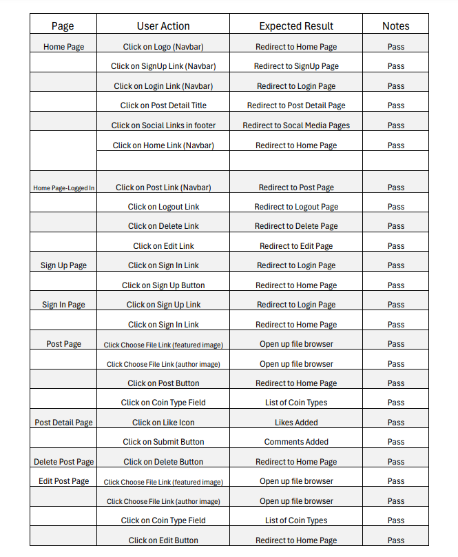

## Testing 

### Validator Testing

Testing with <https://validator.w3.org/> shows no errors in html:

#### Add Post Page

#### Delete Post Page

#### Edit Post Page

#### Index/Home Page

#### Logout Page

#### Login Page

#### Postdetail Page

### Manual Testing

Testing with lighthouse gives the following results:

Testing and validating using pep8 validations tools:
Testing with <https://www.pythonchecker.com/>
Testing the pythonchecker.com came back with good results. Testing the base.html file came back 100% no errors. Testing the other python files came back with minor errors such as "whitespaces around operators" and "add two empty lines in front of function". Nothing that effects functionality.  

Testing with <https://jigsaw.w3.org/css-validator/> show no errors in CSS:

