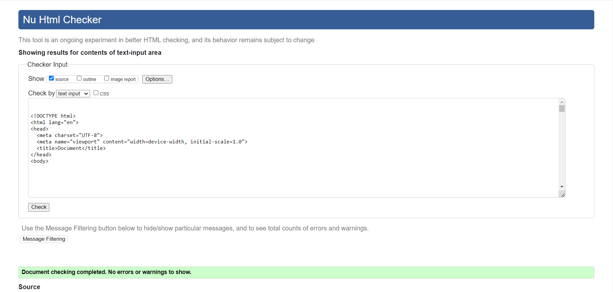

## Testing 
All testing in this project has been done manually during the development process and after. They assumed result of clicking the buttons and testing the features are documented in this Readme file. This has been done by simply clicking on the buttons/links and testing all the functions to see if it produced the desired outcome. All the functions in the project are working. 

Django is a python framework so most of the code is written in python. The part of the code that is in js is the alert messages. They work as expected. CryptoTalk has today no socialmedia today so the links go to their respective homepages.

Because this project was developed with Bootstrap it is fully responsive on all screen sizes.  

In the development of this project I encountered several bugs. They are covered in the bugs section. 

### Automated testing
I initiated the automated testing. I wanted to test with pythons unittest and to use jest for the little js code in the project. However I could not fix the import issue. When running the tests I got the message that its missing a parent directory and I couldn´t import the block of code I wanted tested. To resolve this I contacted the tutor support that Code Institute provides. That tutor couldn´t locate the problem. Considering the deadline and that its not required for this project, I decided to proceed with only manual testing. 

### Validator Testing
-----------------------------------------------------------------------------------------
Testing with <https://validator.w3.org/> shows no errors in html:

#### Signup Page

#### Postlist Page

#### Add Post Page

#### Delete Post Page

#### Edit Post Page

#### Index/Home Page

#### Logout Page

#### Login Page

#### Postdetail Page

#### Edit Comment Page

#### Delete Comment Page

## Lighthouse

Testing with lighthouse gives the following results:

## Python Testing

Testing and validating using pep8 validations tools:
Testing with <https://www.pythonchecker.com/>
Testing the pythonchecker.com came back with good results. Testing the base.html file came back 100% no errors. 

## CSS Testing

Testing with <https://jigsaw.w3.org/css-validator/> show no errors in CSS:

## Features Testing
 
| Page          | User Action   | Expected Result  | Notes            |
|---------------|---------------|------------------|------------------|
| Home Page     |               |                  |                  |
|               | Click on Logo (Navbar) | Redirect to Home Page | PASS        |
|               | Click on Login link (Navbar) | Redirect to Login Page | PASS  
|               | Click on Sign Up link | Redirect to Sign Up page | PASS |
|               | Click on Social links in footer | Open new tab with appropriate link | PASS |
|               | Click on Home link (Navbar) | Redirect to Home page | PASS |
| Home Page (Logged In - User)  |                 |          |  |
|               | Click on Logo (Navbar) | Redirect to Home Page | PASS        |
|               | Click on Add Post link (Navbar) | Redirect to Add Post page | PASS |
|               | Click on Posts link (Navbar) | Redirect to Postlist page | PASS |
|               | Click on Logout link (Navbar)| Redirect to Logout page | PASS |
|               | Click on Home link (Navbar) | Redirect to Home page | PASS |
|               | Click on Social links in footer | Open new tab with appropriate link | PASS |
| Postlist Page     |               |                  |                  |
|               | Click on Logo (Navbar) | Redirect to Home Page | PASS        |
|               | Click on Add Post link (Navbar) | Redirect to Add Post page | PASS |
|               | Click on Posts link (Navbar) | Redirect to Postlist page | PASS |
|               | Click on Logout link (Navbar)| Redirect to Logout page | PASS |
|               | Click on Home link (Navbar) | Redirect to Home page | PASS |
|               | Click on Social links in footer | Open new tab with appropriate link | PASS |
|               | Click on Post detail title | Redirect to Post detail page | PASS |
|               | Click on Edit link | Redirect to Edit Post page | PASS |
|               | Click on Delete link | Redirect to Delete Post page | PASS |
| Login Page  |                  |                  |                  |
|               | Click on Logo (Navbar) | Redirect to Home Page | PASS        |
|               | Click on Sign up link| Redirect to Sing Up page | PASS |
|               | Click on Sign up link (Navbar)| Redirect to Sing Up page | PASS |
|               | Click on Login button | Redirect to Home page | PASS |
|               | Click on Social links in footer | Open new tab with appropriate link | PASS |
|               | Click on Home link (Navbar) | Redirect to Home page | PASS |
|               | Try without username | Must provide user name| PASS |
|               | Try without password | Must provide password| PASS |
| Sign Up Page  |                  |                  |                  |
|               | Click on Sign up button | Redirect to Home page | PASS |
|               | Try without username | Must provide user name| PASS |
|               | Try without password | Must provide password| PASS |
|               | Valid password and username | Logs in, message that you signed in | PASS |
|               | Click Login link | Redirect to Login page | PASS |
|               | Click on Social links in footer | Open new tab with appropriate link | PASS |
| Logout Page  |                  |                  |                  |
|               | Click on Logo (Navbar) | Redirect to Home Page | PASS        |
|               | Click on Add Post link (Navbar) | Redirect to Add Post page | PASS |
|               | Click on Posts link (Navbar) | Redirect to Postlist page | PASS |
|               | Click on Logout link (Navbar)| Redirect to Logout page | PASS |
|               | Click on Home link (Navbar) | Redirect to Home page | PASS |
|               | Click on Sign Out button | Redirect to Home page, message that you signed out | PASS |
| Post Page |                  |                  |                  |
|               | Click on Choose file link (featured image) | Open up file browser| PASS |
|               | Click on Choose file link (author image) | Open up file browser| PASS |
|               | Click on Post button | Redirect to Home page, message that you made a post | PASS |
|               | Click on Coin type field| List of Coin Types| PASS |
| Post Detail Page |                  |                  |                  |
|               | Click on Like icon | Likes added | PASS |
|               | Click on submit button | Comments added | PASS |
|               | Click on edit link | Redirect to Edit Post Page    | PASS |
|               | Click on delete link | Redirect to Delete Post Page    | PASS |
| Edit Post Page |                  |                  |                  |
|               | Click on Choose file link (featured image) | Open up file browser| PASS |
|               | Click on Choose file link (author image) | Open up file browser| PASS |
|               | Click on Submit button | Redirect to Home page, message that you made a post | PASS |
|               | Click on Coin type field| List of Coin Types| PASS |
| Delete Post Page |  |    |    |
|               | Click on Delete button| Redirect to Home page, message that you deleted a post | PASS |
| Edit Comment Page |  |    |    |
|               | Click on Submit button| Redirect to Home page, message that you edited a comment| PASS |
| Delete Comment Page |  |    |    |
|               | Click on Delete button| Redirect to Home page, message that you deleted a comment | PASS |
| 404 Error Page |  |    |    |
|               | Type in URL that does not exists | Custom 404 Error page is displayed | PASS |
|               | Click on Take Me Home button | Redirect to Home page | PASS |
| 500 Error Page |  |    |    |
|               | Admin raise exception in views.py | Custom 500 Error page is displayed, local development testing | PASS |
|               | Click on Take me home button | Redirect to Home page | PASS |
| Admin Panel |  |    |    |
|               | CRUD functionality | Working as expected | PASS |

