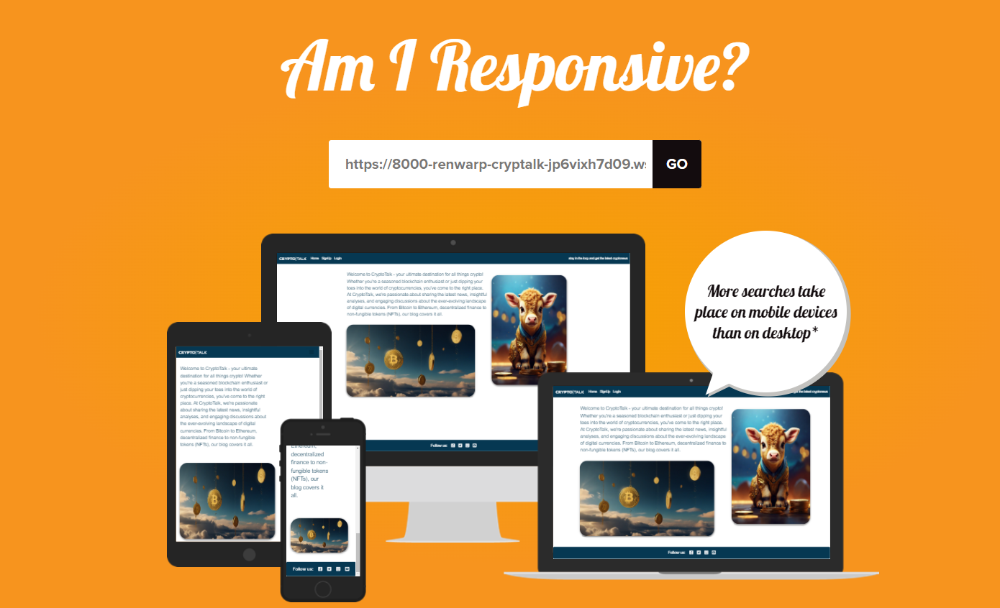
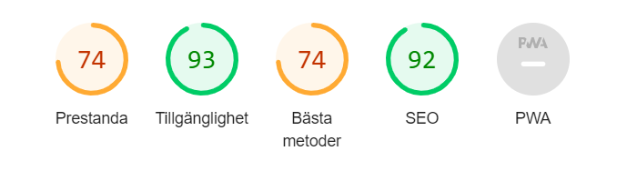

# CryptoTalk Testing 
All testing in this project has been done manually during the development process and after. They assumed result of clicking the buttons and testing the features are documented in this Testing.md file. This has been done by simply clicking on the buttons/links and testing all the functions to see if it produced the desired outcome. All the functions in the project are working. 

Django is a python framework so most of the code is written in python. The part of the code that is in js is the alert messages. They work as expected. CryptoTalk has today no socialmedia today so the links go to their respective homepages.

Because this project was developed with Bootstrap it is fully responsive on all screen sizes.  

### Table of Content
---------------------------------------------------------------------

- [Table of Content](#table-of-content)
- [Responsiveness Testing](#responsiveness-testing)
- [Browser Compatibility Testing](#browser-compatibility-testing)
 - [Validator Testing](#validator-testing)
      - [Validator Testing Signup Page](#signup-page)
      - [Validator Testing Postlists Page](#postlists-page)
      - [Validator Testing Add Post Page](#add-post-page)
      - [Validator Testing Delete Post Page](#delete-post-page)
      - [Validator Testing Edit Post Page](#edit-post-page)
      - [Validator Testing Home Page](#home-page)
      - [Validator Testing Logout Page](#logout-page)
      - [Validator Testing Login Page](#login-page)
      - [Validator Testing Postdetail Page](#postdetail-page)
      - [Validator Testing Edit Comment Page](#edit-comment-page)
      - [Validator Testing Delete Comment Page](#delete-comment-page)
      - [Validator Testing 404 Page](#404-page)
      - [Validator Testing 500 Page](#500-page)
- [Lighthouse](#lighthouse)
- [CSS Testing](#css-testing)
- [Features Testing](#features-testing)
      

### Responsiveness Testing
----------------------------------------------
The site went through responsiveness testing in DevTools and at [amiresponsive.co.uk](https://amiresponsive.co.uk/). 

 Desktop PC

 Laptop

 Tablet

 Mobile

### Browser Compatibility Testing

The project was tested on multiple web browsers to check for compatibility issues. This is done to make sure that the user will have a pleasant UX regardless of the webbrowser.

 Chrome

 Microsoft Edge

 Mozilla Firefox

### Validator Testing
-----------------------------------------------------------------------------------------
Testing with <https://validator.w3.org/> shows no errors in html:

#### Signup Page

#### Postlist Page

#### Add Post Page

#### Delete Post Page

#### Edit Post Page

#### Home Page

#### Logout Page

#### Login Page

#### Postdetail Page

#### Edit Comment Page

#### Delete Comment Page

#### 404 Page

#### 500 Page

## Lighthouse

Testing with lighthouse gives the following results:

## Python Testing

Testing and validating using pep8 validations tools:
Testing with <https://www.pythonchecker.com/>
Testing the pythonchecker.com came back with good results. Testing the base.html file came back 100% no errors. 

## CSS Testing

Testing with <https://jigsaw.w3.org/css-validator/> show no errors in CSS:

## Features Testing
 
| Page          | User Action   | Expected Result  | Notes            |
|---------------|---------------|------------------|------------------|
| Home Page     |               |                  |                  |
|               | Click on Logo (Navbar) | Redirect to Home Page | PASS        |
|               | Click on Login link (Navbar) | Redirect to Login Page | PASS  
|               | Click on Sign Up link | Redirect to Sign Up page | PASS |
|               | Click on Social links in footer | Open new tab with appropriate link | PASS |
|               | Click on Home link (Navbar) | Redirect to Home page | PASS |
| Home Page (Logged In - User)  |                 |          |  |
|               | Click on Logo (Navbar) | Redirect to Home Page | PASS        |
|               | Click on Add Post link (Navbar) | Redirect to Add Post page | PASS |
|               | Click on Posts link (Navbar) | Redirect to Postlist page | PASS |
|               | Click on Logout link (Navbar)| Redirect to Logout page | PASS |
|               | Click on Home link (Navbar) | Redirect to Home page | PASS |
|               | Click on Social links in footer | Open new tab with appropriate link | PASS |
| Postlist Page     |               |                  |                  |
|               | Click on Logo (Navbar) | Redirect to Home Page | PASS        |
|               | Click on Add Post link (Navbar) | Redirect to Add Post page | PASS |
|               | Click on Posts link (Navbar) | Redirect to Postlist page | PASS |
|               | Click on Logout link (Navbar)| Redirect to Logout page | PASS |
|               | Click on Home link (Navbar) | Redirect to Home page | PASS |
|               | Click on Social links in footer | Open new tab with appropriate link | PASS |
|               | Click on Post detail title | Redirect to Post detail page | PASS |
|               | Click on Edit link | Redirect to Edit Post page | PASS |
|               | Click on Delete link | Redirect to Delete Post page | PASS |
| Login Page  |                  |                  |                  |
|               | Click on Logo (Navbar) | Redirect to Home Page | PASS        |
|               | Click on Sign up link| Redirect to Sing Up page | PASS |
|               | Click on Sign up link (Navbar)| Redirect to Sing Up page | PASS |
|               | Click on Login button | Redirect to Home page | PASS |
|               | Click on Social links in footer | Open new tab with appropriate link | PASS |
|               | Click on Home link (Navbar) | Redirect to Home page | PASS |
|               | Try without username | Must provide user name| PASS |
|               | Try without password | Must provide password| PASS |
|               | Logging in| Confirmation that the user has logged in | PASS |
| Sign Up Page  |                  |                  |                  |
|               | Click on Sign up button | Redirect to Home page | PASS |
|               | Try without username | Must provide user name| PASS |
|               | Try without password | Must provide password| PASS |
|               | Valid password and username | Logs in, message that you signed in | PASS |
|               | Click Login link | Redirect to Login page | PASS |
|               | Click on Social links in footer | Open new tab with appropriate link | PASS |
|               | Signing up| Confirmation that the user has logged in | PASS |
| Logout Page  |                  |                  |                  |
|               | Click on Logo (Navbar) | Redirect to Home Page | PASS        |
|               | Click on Add Post link (Navbar) | Redirect to Add Post page | PASS |
|               | Click on Posts link (Navbar) | Redirect to Postlist page | PASS |
|               | Click on Logout link (Navbar)| Redirect to Logout page | PASS |
|               | Click on Social links in footer | Open new tab with appropriate link | PASS |
|               | Click on Home link (Navbar) | Redirect to Home page | PASS |
|               | Click on Sign Out button | Redirect to Home page, message that you signed out | PASS |
|               | Logging out | Confirmation that the user has logged out| PASS |
| Post Page |                  |                  |                  |
|               | Click on Logo (Navbar) | Redirect to Home Page | PASS        |
|               | Click on Add Post link (Navbar) | Redirect to Add Post page | PASS |
|               | Click on Posts link (Navbar) | Redirect to Postlist page | PASS |
|               | Click on Logout link (Navbar)| Redirect to Logout page | PASS |
|               | Click on Social links in footer | Open new tab with appropriate link | PASS |
|               | Click on Home link (Navbar) | Redirect to Home page | PASS |
|               | Click on Choose file link (featured image) | Open up file browser| PASS |
|               | Click on Choose file link (author image) | Open up file browser| PASS |
|               | Click on Post button | Redirect to Home page | PASS |
|               | Try without title | Must provide title| PASS |
|               | Try without text | Must provide text| PASS |
|               | Try without adding coin type| Works without adding coin type| PASS |
|               | Try without adding coin description| Works without adding coin description| PASS |
|               | Try without adding coin max cap| Works without adding coin max cap| PASS |
|               | Try without adding coin creator| Works without adding coin creator| PASS |
|               | Creating a post| Confirmation that the post has been created | PASS |
| Post Detail Page |                  |                  |                  |
|               | Click on Logo (Navbar) | Redirect to Home Page | PASS        |
|               | Click on Add Post link (Navbar) | Redirect to Add Post page | PASS |
|               | Click on Posts link (Navbar) | Redirect to Postlist page | PASS |
|               | Click on Logout link (Navbar)| Redirect to Logout page | PASS |
|               | Click on Home link (Navbar) | Redirect to Home page | PASS |
|               | Click on Social links in footer | Open new tab with appropriate link | PASS |
|               | Click on Like icon | Likes added | PASS |
|               | Click on Submit button | Comments added | PASS |
|               | Click on Edit comment link | Redirect to Edit Comment Page    | PASS |
|               | Click on Delete comment link | Redirect to Delete Comment Page    | PASS |
|               | Create a Comment | Confirmation that the comment has been created | PASS |
| Edit Post Page |                  |                  |                  |
|               | Click on Logo (Navbar) | Redirect to Home Page | PASS        |
|               | Click on Add Post link (Navbar) | Redirect to Add Post page | PASS |
|               | Click on Posts link (Navbar) | Redirect to Postlist page | PASS |
|               | Click on Logout link (Navbar)| Redirect to Logout page | PASS |
|               | Click on Home link (Navbar) | Redirect to Home page | PASS |
|               | Click on Social links in footer | Open new tab with appropriate link | PASS |
|               | Click on Choose file link (featured image) | Open up file browser| PASS |
|               | Click on Choose file link (author image) | Open up file browser| PASS |
|               | Click on Post button | Redirect to Home page | PASS |
|               | Try without title | Must provide title| PASS |
|               | Try without text | Must provide text| PASS |
|               | Try without adding coin type| Works without adding coin type| PASS |
|               | Try without adding coin description| Works without adding coin description| PASS |
|               | Try without adding coin max cap| Works without adding coin max cap| PASS |
|               | Try without adding coin creator| Works without adding coin creator| PASS |
|               | Editing/Creating a post| Confirmation that the post has been edited | PASS |PASS |
| Delete Post Page |  |    |    |
|               | Click on Logo (Navbar) | Redirect to Home Page | PASS        |
|               | Click on Add Post link (Navbar) | Redirect to Add Post page | PASS |
|               | Click on Posts link (Navbar) | Redirect to Postlist page | PASS |
|               | Click on Social links in footer | Open new tab with appropriate link | PASS |
|               | Click on Logout link (Navbar)| Redirect to Logout page | PASS |
|               | Click on Home link (Navbar) | Redirect to Home page | PASS |
|               | Click on Delete button| Redirect to Home page, message that you deleted a post | PASS |
|               | Deleting a post| Confirmation that the post has been deleted | PASS |
| Edit Comment Page |  |    |    |
|               | Click on Logo (Navbar) | Redirect to Home Page | PASS        |
|               | Click on Add Post link (Navbar) | Redirect to Add Post page | PASS |
|               | Click on Posts link (Navbar) | Redirect to Postlist page | PASS |
|               | Click on Logout link (Navbar)| Redirect to Logout page | PASS |
|               | Click on Social links in footer | Open new tab with appropriate link | PASS |
|               | Click on Home link (Navbar) | Redirect to Home page | PASS |
|               | Click on Submit button| Redirect to Home page| PASS |
|               |Editing a comment| Confirmation that the comment has been edited | PASS |
| Delete Comment Page |  |    |    |
|               | Click on Logo (Navbar) | Redirect to Home Page | PASS        |
|               | Click on Add Post link (Navbar) | Redirect to Add Post page | PASS |
|               | Click on Posts link (Navbar) | Redirect to Postlist page | PASS |
|               | Click on Logout link (Navbar)| Redirect to Logout page | PASS |
|               | Click on Home link (Navbar) | Redirect to Home page | PASS |
|               | Click on Social links in footer | Open new tab with appropriate link | PASS |
|               | Click on Delete button| Redirect to Home page, message that you deleted a comment | PASS |
| 404 Error Page |  |    |    |
|               | Click on Logo (Navbar) | Redirect to Home Page | PASS        |
|               | Click on Add Post link when logged in (Navbar) | Redirect to Add Post page | PASS |
|               | Click on Social links in footer | Open new tab with appropriate link | PASS |
|               | Click on Login link (Navbar)| Redirect to Login page | PASS |
|               | Click on Signup link (Navbar)| Redirect to Signup page | PASS |
|               | Click on Posts when logged in link (Navbar) | Redirect to Postlist page | PASS |
|               | Click on Logout link when logged in (Navbar)| Redirect to Logout page | PASS |
|               | Click on Home link (Navbar) | Redirect to Home page | PASS |
|               | Type in URL that does not exists | Custom 404 Error page is displayed | PASS |
|               | Click on Take Me Home button | Redirect to Home page | PASS |
| 500 Error Page |  |    |    |
|               | Click on Logo (Navbar) | Redirect to Home Page | PASS        |
|               | Click on Take me home button | Redirect to Add Post page | PASS |
|               | Click on Social links in footer | Open new tab with appropriate link | PASS |
|               | Admin raise exception in views.py | Custom 500 Error page is displayed, local development testing | PASS |
| Admin Panel |  |    |    |
|               | CRUD functionality | Working as expected | PASS |

Return to [README](README.md)

